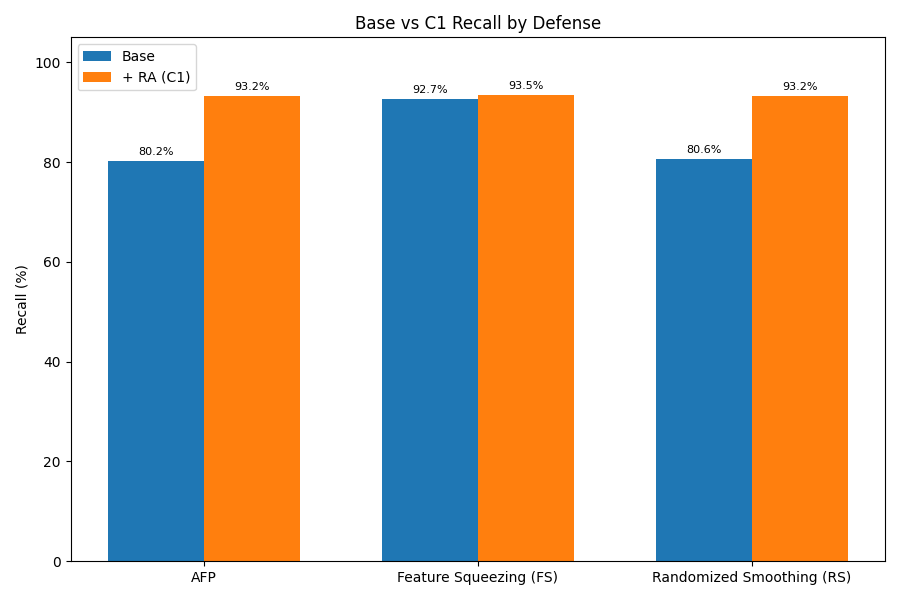
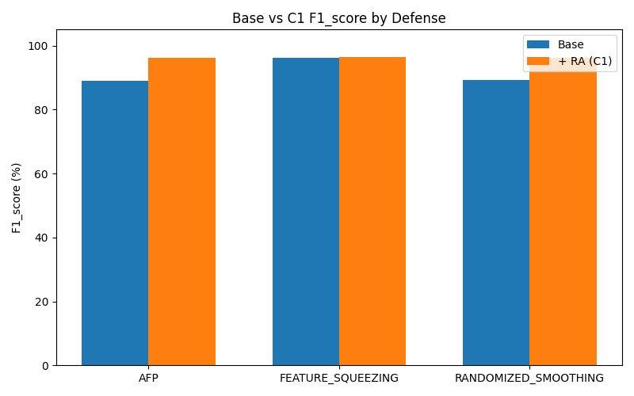
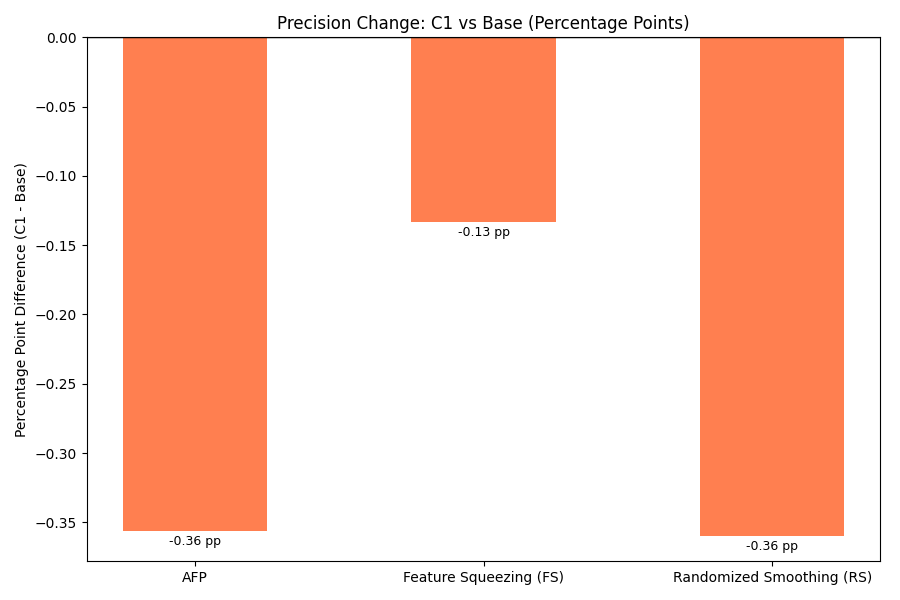
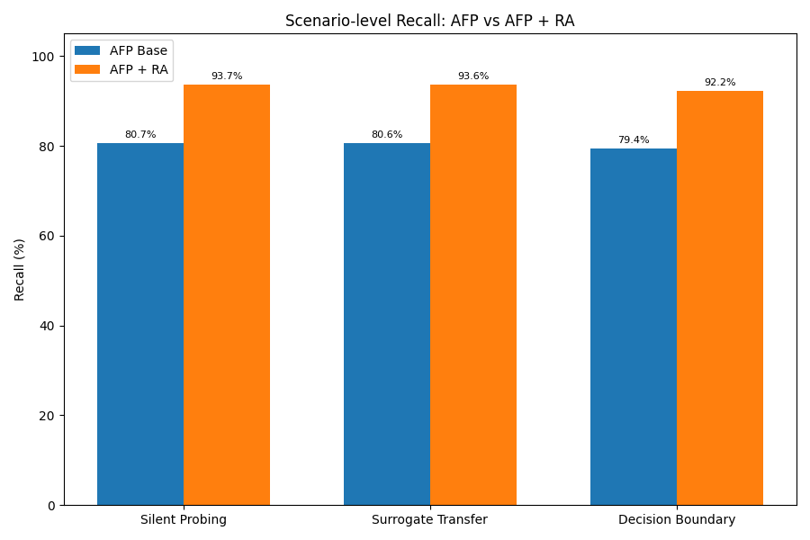
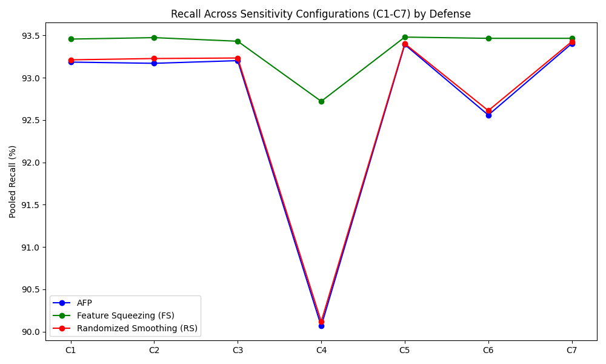

# Chapter 4: Results and Interpretation

## 4.1 Introduction
This chapter presents the statistical analysis of the Recall-Aware (RA) feedback controller. Adaptive Feature Poisoning (AFP), Randomized Smoothing (RS), and Feature Squeezing (FS) are existing defense mechanisms. The proposed contribution of this thesis is the RA controller, which augments these existing defenses by dynamically adjusting their perturbation intensity using Rolling Recall. The valid internal matched comparison within this study is each implemented fixed-intensity Base defense versus the same defense augmented with the C1 Recall-Aware controller (denoted as AFP + RA, RS + RA, and FS + RA for clarity).

## 4.2 RQ1: Base Defense Performance
Table 4.1 summarizes the Precision, Recall, and F1-Score of the fixed-intensity Base defenses across attack scenarios.

| Defense | Scenario | Precision | Recall | F1-Score |
|---|---|---|---|---|
| AFP | Silent Probing | 99.92% | 80.66% | 89.21% |
| AFP | Surrogate Transfer | 99.93% | 80.62% | 89.19% |
| AFP | Decision Boundary | 99.93% | 79.40% | 88.43% |
| Feature Squeezing (FS) | Silent Probing | 99.86% | 93.19% | 96.39% |
| Feature Squeezing (FS) | Surrogate Transfer | 99.86% | 93.19% | 96.39% |
| Feature Squeezing (FS) | Decision Boundary | 99.86% | 91.66% | 95.56% |
| Randomized Smoothing (RS) | Silent Probing | 99.95% | 80.95% | 89.39% |
| Randomized Smoothing (RS) | Surrogate Transfer | 99.95% | 81.06% | 89.47% |
| Randomized Smoothing (RS) | Decision Boundary | 99.95% | 79.70% | 88.63% |

## 4.3 RQ2: Controller-Augmented Defense Performance
Table 4.2 summarizes the performance of the existing defenses augmented with the proposed RA controller (C1).

| Defense | Scenario | Precision | Recall | F1-Score |
|---|---|---|---|---|
| AFP + RA | Silent Probing | 99.59% | 93.70% | 96.53% |
| AFP + RA | Surrogate Transfer | 99.61% | 93.64% | 96.51% |
| AFP + RA | Decision Boundary | 99.52% | 92.25% | 95.72% |
| Feature Squeezing (FS) + RA | Silent Probing | 99.74% | 93.94% | 96.74% |
| Feature Squeezing (FS) + RA | Surrogate Transfer | 99.74% | 93.93% | 96.73% |
| Feature Squeezing (FS) + RA | Decision Boundary | 99.70% | 92.49% | 95.94% |
| Randomized Smoothing (RS) + RA | Silent Probing | 99.64% | 93.68% | 96.55% |
| Randomized Smoothing (RS) + RA | Surrogate Transfer | 99.61% | 93.70% | 96.54% |
| Randomized Smoothing (RS) + RA | Decision Boundary | 99.52% | 92.25% | 95.72% |

### RQ1 and RQ2 Interpretation
Scenario-level patterns show that the Recall-Aware controller yielded large Recall gains for AFP and RS across all scenarios, while FS exhibited a smaller but consistent gain. Base Precision was already near 1.00 for most configurations, meaning the controller operated near the upper bound of Precision. While the RA controller provided statistically significant improvements to Recall and F1-Score, statistical significance should not be equated with practical superiority without considering the operational context. AFP, RS, and FS serve as the existing defensive foundations, whereas the RA controller is the proposed augmentation.

## 4.4 RQ3: Statistical Differences (Base vs. C1)
The locked primary analysis consists of 2,160 C1 minus Base batch pairs per defense and metric. Raw two-tailed paired t-test p-values at α = .05 determine the primary decision. Holm adjustment is provided as supplementary robustness evidence. Note that serial dependence at the batch level is a known limitation.

| Defense | Metric | Base Mean | C1 Mean | C1-Base Diff | 95% CI | t-stat (df=2159) | p_raw | Decision | Holm | dz | Direction |
|---|---|---|---|---|---|---|---|---|---|---|---|
| AFP | precision | 0.9993 | 0.9957 | -0.0036 | [-0.0038, -0.0033] | -24.90 | <.001 | significant | <.001 | -0.54 | decreased |
| AFP | recall | 0.8023 | 0.9319 | 0.1297 | [0.1281, 0.1313] | 161.50 | <.001 | significant | <.001 | 3.47 | improved |
| AFP | f1_score | 0.8894 | 0.9625 | 0.0731 | [0.0721, 0.0740] | 149.81 | <.001 | significant | <.001 | 3.22 | improved |
| Randomized Smoothing (RS) | precision | 0.9995 | 0.9959 | -0.0036 | [-0.0039, -0.0033] | -25.85 | <.001 | significant | <.001 | -0.56 | decreased |
| Randomized Smoothing (RS) | recall | 0.8057 | 0.9321 | 0.1264 | [0.1249, 0.1280] | 159.38 | <.001 | significant | <.001 | 3.43 | improved |
| Randomized Smoothing (RS) | f1_score | 0.8916 | 0.9627 | 0.0711 | [0.0701, 0.0720] | 147.58 | <.001 | significant | <.001 | 3.18 | improved |
| Feature Squeezing (FS) | precision | 0.9986 | 0.9973 | -0.0013 | [-0.0015, -0.0011] | -13.00 | <.001 | significant | <.001 | -0.28 | decreased |
| Feature Squeezing (FS) | recall | 0.9268 | 0.9345 | 0.0077 | [0.0073, 0.0081] | 37.78 | <.001 | significant | <.001 | 0.81 | improved |
| Feature Squeezing (FS) | f1_score | 0.9611 | 0.9647 | 0.0036 | [0.0033, 0.0038] | 29.48 | <.001 | significant | <.001 | 0.63 | improved |

### Supplementary Robustness and Effect Sizes
Supplementary run-level paired analysis confirmed the direction of change observed at the batch level. Holm-adjusted results across all nine primary tests supported the raw decisions. While Shapiro-Wilk diagnostics indicated non-normality, the large sample size ensures t-test robustness, and Wilcoxon signed-rank tests confirmed the directional shifts. The batch-level serial-dependence limitation is acknowledged, and the run-level analyses serve as robustness checks rather than replacing the primary analysis. Computational underflow in p-values is reported as p < .001 rather than exactly zero.

Effect sizes must be interpreted carefully: AFP and RS Recall and F1-Score changes are very large under the batch-level Cohen's dz calculation. FS Recall and F1 improvements are smaller in absolute percentage points, even though their standardized effects remain nontrivial. Precision decreases across all defenses are small in absolute percentage points.

## 4.5 RQ4: Sensitivity Analysis (C1–C7)
The sensitivity analysis evaluated alternative controller parameter configurations (C1–C7) utilizing seeds 42–44, yielding 432 batches per defense, scenario, and configuration. These sample counts are distinct from the five-seed primary comparison. The pooled descriptive results across the three attacks demonstrate the Precision-Recall trade-off inherent in the controller's design. 

| Defense | Config | Pooled Precision | Pooled Recall | Pooled F1-Score |
|---|---|---|---|---|
| AFP | C1 | 99.58% | 93.18% | 96.25% |
| AFP | C2 | 99.58% | 93.17% | 96.24% |
| AFP | C3 | 99.55% | 93.20% | 96.25% |
| AFP | C4 | 99.84% | 90.07% | 94.66% |
| AFP | C5 | 99.44% | 93.39% | 96.29% |
| AFP | C6 | 99.74% | 92.56% | 95.99% |
| AFP | C7 | 99.45% | 93.40% | 96.31% |
| Feature Squeezing (FS) | C1 | 99.73% | 93.46% | 96.47% |
| Feature Squeezing (FS) | C2 | 99.71% | 93.47% | 96.47% |
| Feature Squeezing (FS) | C3 | 99.74% | 93.43% | 96.46% |
| Feature Squeezing (FS) | C4 | 99.85% | 92.72% | 96.13% |
| Feature Squeezing (FS) | C5 | 99.71% | 93.48% | 96.48% |
| Feature Squeezing (FS) | C6 | 99.73% | 93.46% | 96.47% |
| Feature Squeezing (FS) | C7 | 99.70% | 93.46% | 96.46% |
| Randomized Smoothing (RS) | C1 | 99.60% | 93.21% | 96.27% |
| Randomized Smoothing (RS) | C2 | 99.60% | 93.23% | 96.28% |
| Randomized Smoothing (RS) | C3 | 99.55% | 93.23% | 96.26% |
| Randomized Smoothing (RS) | C4 | 99.85% | 90.12% | 94.70% |
| Randomized Smoothing (RS) | C5 | 99.44% | 93.40% | 96.30% |
| Randomized Smoothing (RS) | C6 | 99.75% | 92.61% | 96.02% |
| Randomized Smoothing (RS) | C7 | 99.46% | 93.43% | 96.32% |

Across all defenses, C4 achieved the highest pooled Precision, accompanied by visibly lower Recall and F1-Score. For AFP and Randomized Smoothing, C7 achieved the highest pooled Recall and F1-Score. For Feature Squeezing, C5 achieved the highest pooled Recall and F1-Score. Differences among several non-C4 configurations are small and should not be exaggerated. No single configuration is declared universally optimal; rather, the configurations provide a spectrum of trade-offs. No new hypothesis tests were performed on these sensitivity results.

## 4.6 Integrated Discussion and AFP Interpretation
Motivation for addressing Recall limitations is drawn from the original AFP paper, Ennaji et al. (2025). Table 4 of their study reports attack Recall values of 0.03, 0.42, and 0.01 while some corresponding accuracy values are much higher. As accuracy may conceal missed attacks under severe class imbalance, noting these reporting inconsistencies professionally highlights the need for recall-aware stabilization. However, we do not claim direct numerical improvement from the original paper’s 3%, 42%, and 1% values to this study’s approximately 92%–94%, as the implementations and protocols differ fundamentally.

The valid internal matched comparison in this study is Base AFP versus AFP + RA under controlled conditions. RA increased AFP Recall and F1 across Silent Probing (approx. 80.66% Base to 93.70% C1), Surrogate Transfer (approx. 80.62% Base to 93.64% C1), and Decision Boundary (approx. 79.40% Base to 92.25% C1). This improvement came with a small decrease in Precision. The controller effectively mitigated recall degradation associated with fixed perturbation intensity under this study’s conditions.

## 4.7 Figures
- **Figure 4.1: Base vs C1 Recall by Defense** (Data: RQ1/RQ2 pooled means. Shows the absolute Recall gain from RA augmentation.)
  

- **Figure 4.2: Base vs C1 F1-Score by Defense** (Data: RQ1/RQ2 pooled means. Shows the F1-Score gain.)
  

- **Figure 4.3: Precision Change: C1 vs Base (Percentage Points)** (Data: RQ1/RQ2 pooled difference. Highlights the small relative decrease in Precision without misleading axis truncation.)
  

- **Figure 4.4: Scenario-level Recall: AFP vs AFP + RA** (Data: RQ1/RQ2 scenario-level AFP means. Shows consistent Recall improvement across all three attack profiles.)
  

- **Figure 4.5: Recall Across Sensitivity Configurations (C1-C7) by Defense** (Data: RQ4 pooled means. Illustrates the sensitivity trade-off across all three tested defenses without implying statistical testing.)
  

## 4.8 Summary of Findings
The proposed Recall-Aware controller improved Recall and F1-Score when added to AFP, Randomized Smoothing, and Feature Squeezing under the frozen controlled evaluation, with a small reduction in Precision.

## 4.9 Methodological Limitations
- Serial dependence in batch-level observations is present.
- Results are constrained to the specific dataset, attacks, classifier, and conditions tested.
- The study does not claim universal real-world superiority, perfect attack prevention, or improvement to the Random Forest classifier itself.
